# Sequence Diagrams — Dog Walking

Interaction flows for the Dog Walking domain. Diagrams reference
operation paths from `contracts/openapi.yaml` and event channels
from `contracts/asyncapi.yaml` (Phase 6) by name. Participants are
named consistently with the auth-matrix roles (`walker`, `owner`)
and the conventional system actors (`API`, `EventBus`).

---

## Flow 1: Authentication — Walker self-registers, logs in, refreshes, logs out

Covers US-000, US-003, US-021, US-022.

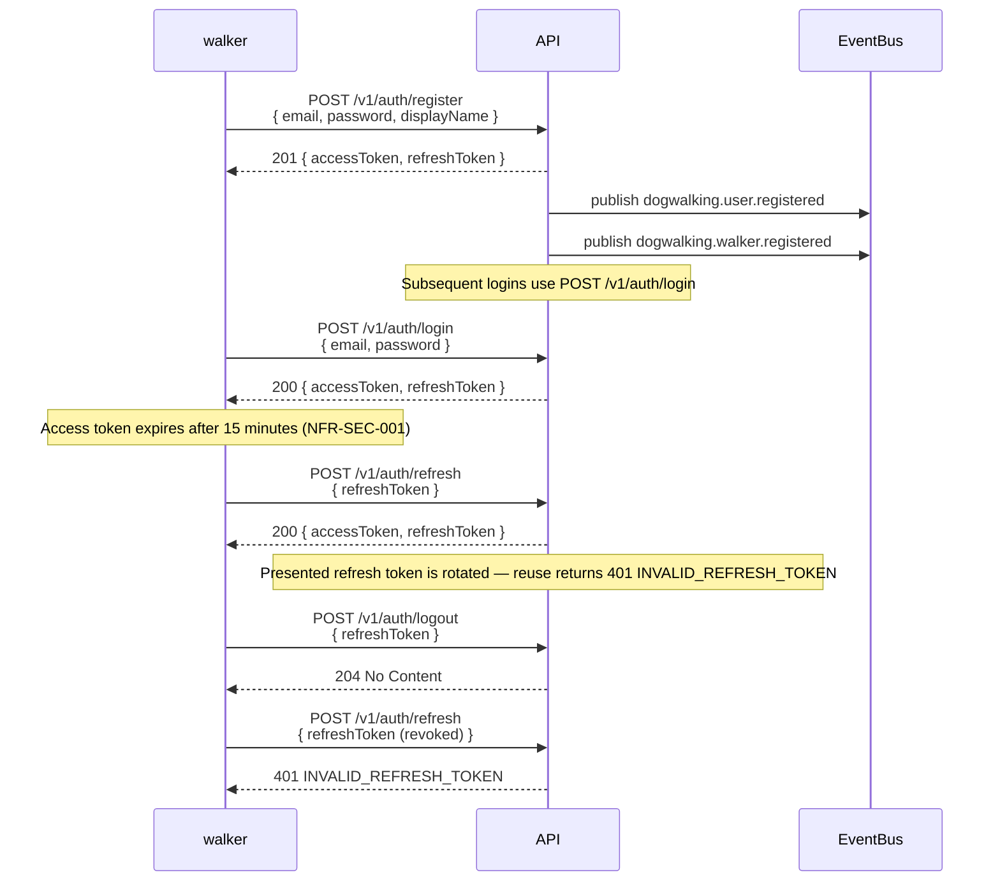

---

## Flow 2: Authentication — Client invite + registration + login

Covers US-001 (walker adds client), US-002 (client accepts invite),
US-003 (subsequent logins).

```mermaid
sequenceDiagram
    participant walker
    participant API
    participant EventBus
    participant owner

    walker->>API: POST /v1/clients<br/>{ name, email }
    API-->>walker: 201 { id, email, status: "pending", expiresAt }
    API->>EventBus: publish dogwalking.invite.created
    Note over API: Invite email queued with 1-day TTL.<br/>No Client record yet — it is created at acceptance.

    owner->>API: POST /v1/invites/{token}/accept<br/>{ password }
    API-->>owner: 200 { accessToken, refreshToken }
    API->>EventBus: publish dogwalking.invite.accepted
    API->>EventBus: publish dogwalking.user.registered
    API->>EventBus: publish dogwalking.client.registered
    Note over API: Client record created here; invite.accepted and<br/>client.registered both carry inviteId for lineage

    owner->>API: POST /v1/auth/login<br/>{ email, password }
    API-->>owner: 200 { accessToken, refreshToken }
```

---

## Flow 2a: Authentication — Invite lifecycle (pending → accepted; expired path)

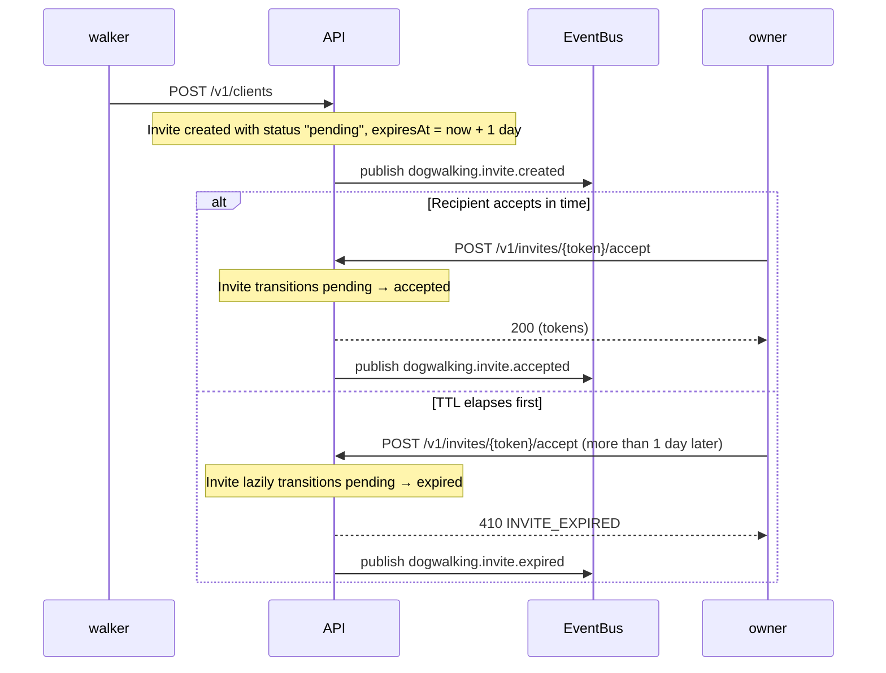

---

## Flow 3: Authentication — Password reset

Covers US-004.

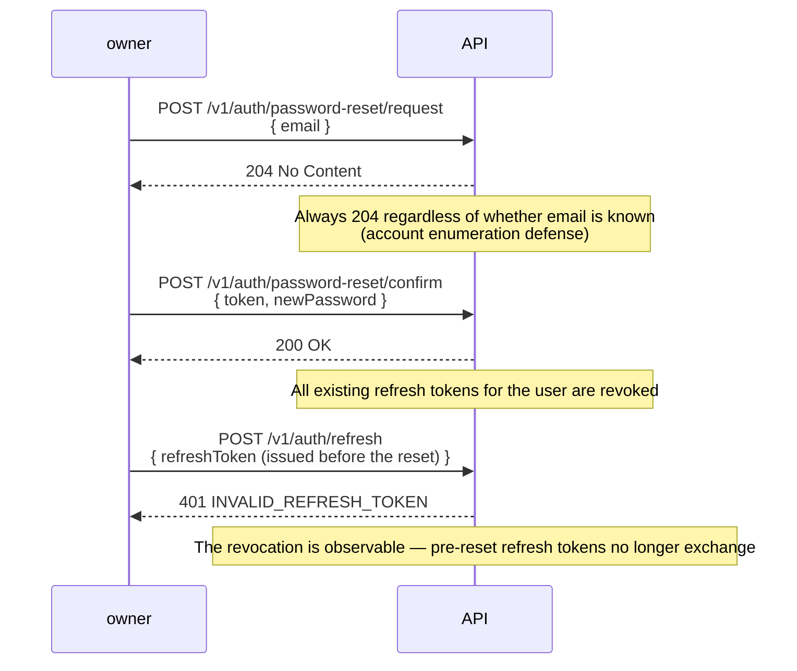

---

## Flow 3b: Authentication — Password-reset token lifecycle (pending → used; expired path)

```mermaid
sequenceDiagram
    participant owner
    participant API

    owner->>API: POST /v1/auth/password-reset/request
    Note over API: Reset token created with status "pending", expiresAt = now + 1 hour

    alt Confirm in time
        owner->>API: POST /v1/auth/password-reset/confirm {token, newPassword}
        Note over API: Token transitions pending → used; refresh tokens revoked
        API-->>owner: 200 OK
    else TTL elapses first
        owner->>API: POST /v1/auth/password-reset/confirm (more than 1 hour later)
        Note over API: Token lazily transitions pending → expired
        API-->>owner: 410 RESET_TOKEN_EXPIRED
    end
```

---

## Flow 4: Dogs — Owner adds, views, and updates a dog

Covers US-005, US-006, US-020.

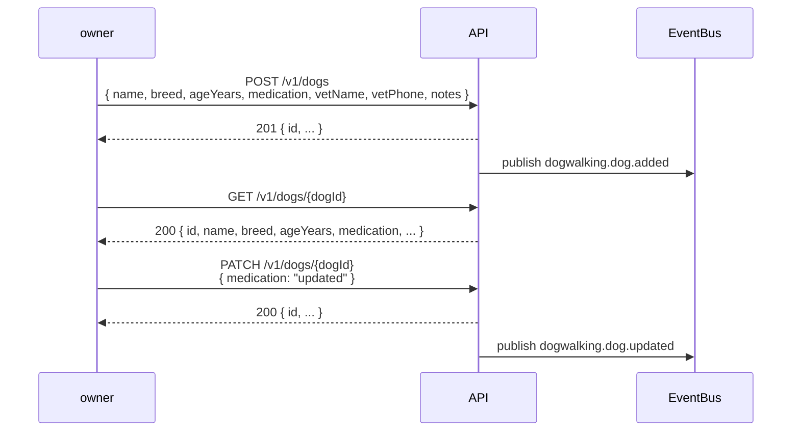

---

## Flow 5: Bookings — Owner-requested walk → walker decides

Covers US-007 (owner path), US-008, US-009, US-010.

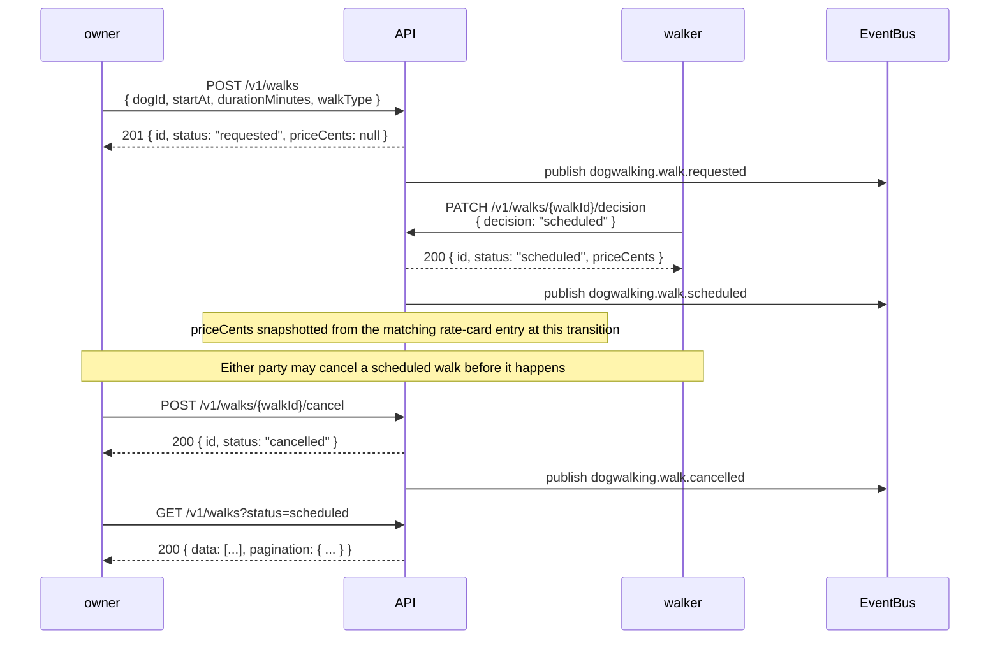

---

## Flow 6: Bookings — Walker declines a request

Covers the `requested → declined` path of US-008.

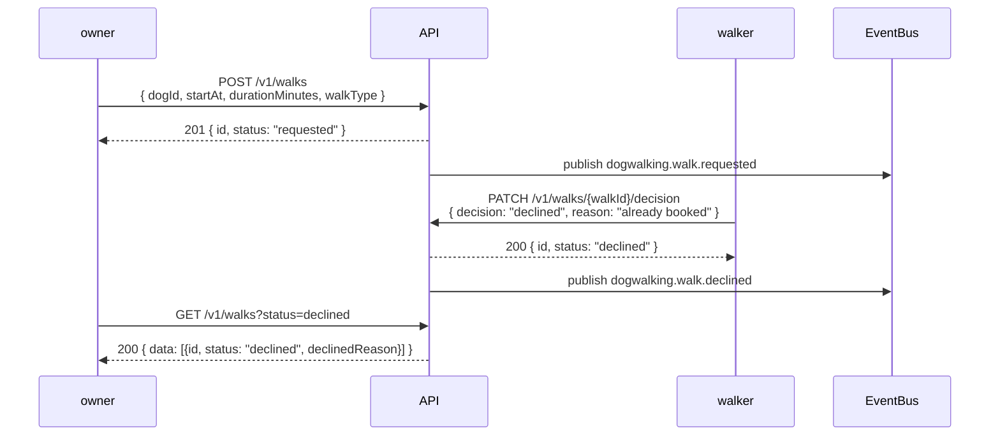

---

## Flow 7: Bookings — Walker creates walk directly (skip request stage)

Covers US-007 (walker path) — when Alison takes a booking via
WhatsApp and enters it in the app on the client's behalf.

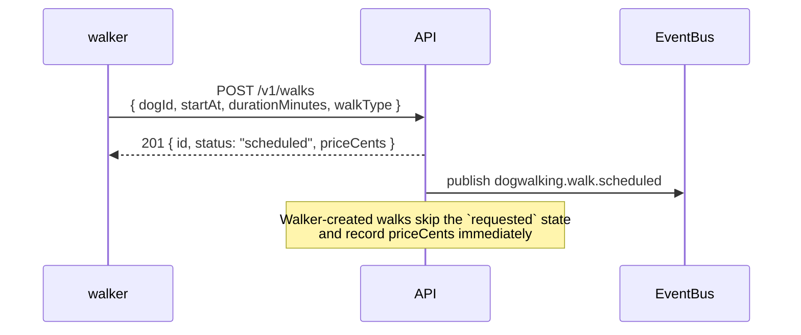

---

## Flow 8: Walks — Complete + post updates with photos

Covers US-011, US-012, US-013.

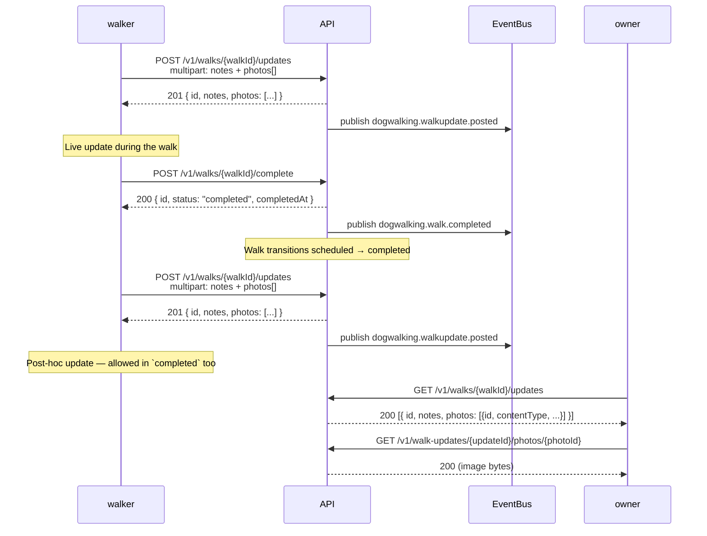

---

## Flow 9: Pricing — Walker sets rate card, owner views it

Covers US-017, US-018.

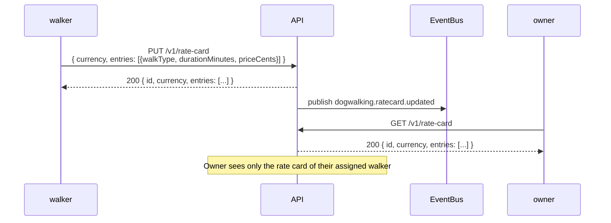

---

## Flow 10: Invoicing — Generate, view, mark paid

Covers US-014, US-015, US-016.

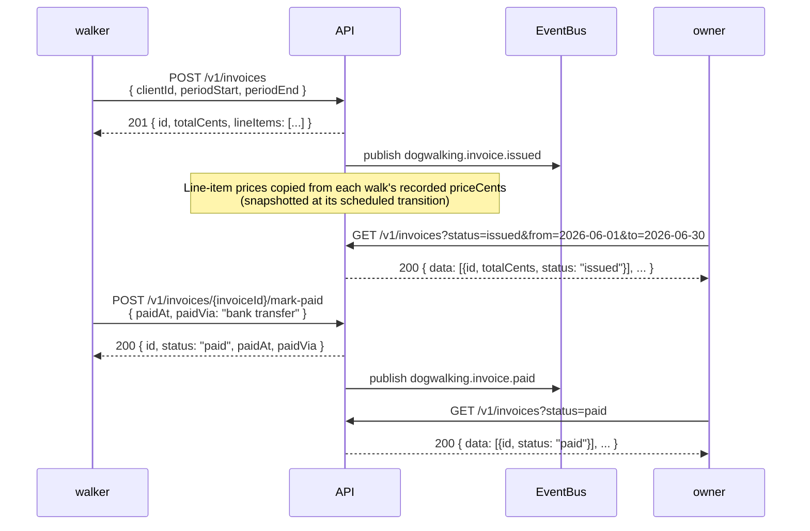

---

## Flow 11: Instance status — first-run detection (US-023)

Covers US-023.

```mermaid
sequenceDiagram
    participant anon as sign-in screen
    participant API

    anon->>API: GET /v1/instance (no auth)
    API-->>anon: 200 { walkerRegistered: false, walkerDisplayName: null }
    Note over anon: Fresh instance — offer "Set up this instance as the walker"

    Note over anon,API: ...walker registers (Flow 1)...

    anon->>API: GET /v1/instance (no auth)
    API-->>anon: 200 { walkerRegistered: true, walkerDisplayName: "Alison" }
    Note over anon: Hide first-run setup; show whose business this is
```

---

## Flow 12: Clients — Walker views a client and their dogs (US-024)

Covers US-024.

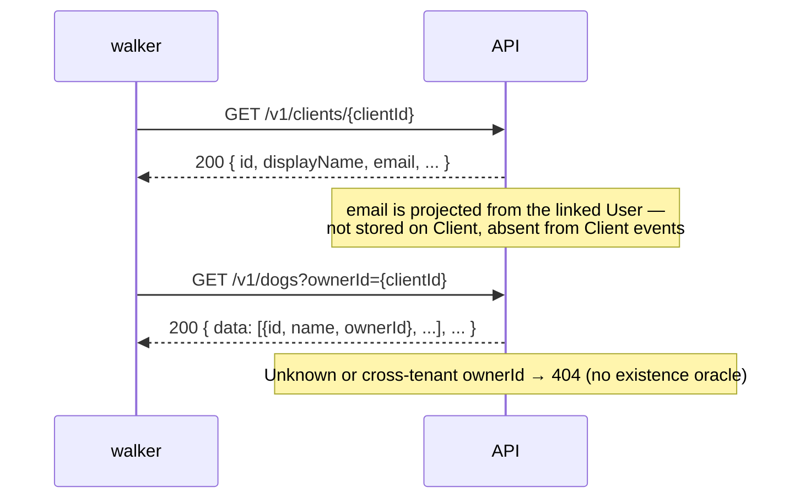

---

## Flow 13: Dogs — Profile photo gallery (US-025)

Covers US-025.

```mermaid
sequenceDiagram
    participant owner
    participant API
    participant EventBus
    participant walker

    owner->>API: POST /v1/dogs/{dogId}/photos (multipart, one photo)
    API-->>owner: 201 { id, dogId, contentType, sizeBytes }
    API->>EventBus: publish dogwalking.dogphoto.added
    Note over API: Max 5 per dog — sixth returns 409 PHOTO_LIMIT_EXCEEDED

    walker->>API: GET /v1/dogs/{dogId}/photos/{photoId}
    API-->>walker: 200 (image bytes, authenticated stream)

    walker->>API: DELETE /v1/dogs/{dogId}/photos/{photoId}
    API-->>walker: 204
    API->>EventBus: publish dogwalking.dogphoto.removed
    Note over API: Slot freed; storage quota reclaimed (NFR-DATA-003)
```
