# Sequence Diagrams — Dog Walking

Interaction flows for the Dog Walking domain. Diagrams reference
operation paths from `contracts/openapi.yaml` and event channels
from `contracts/asyncapi.yaml` (Phase 6) by name. Participants are
named consistently with the auth-matrix roles (`walker`, `owner`)
and the conventional system actors (`API`, `EventBus`).

---

## Flow 1: Authentication — Walker self-registers and logs in

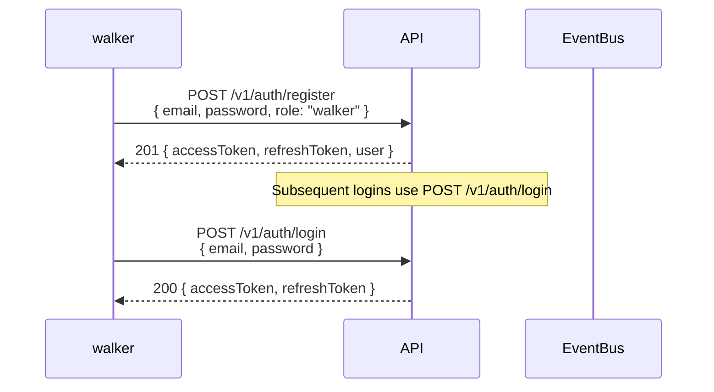

---

## Flow 2: Authentication — Client invite + registration + login

Covers US-001 (walker adds client), US-002 (client accepts invite),
US-003 (subsequent logins).

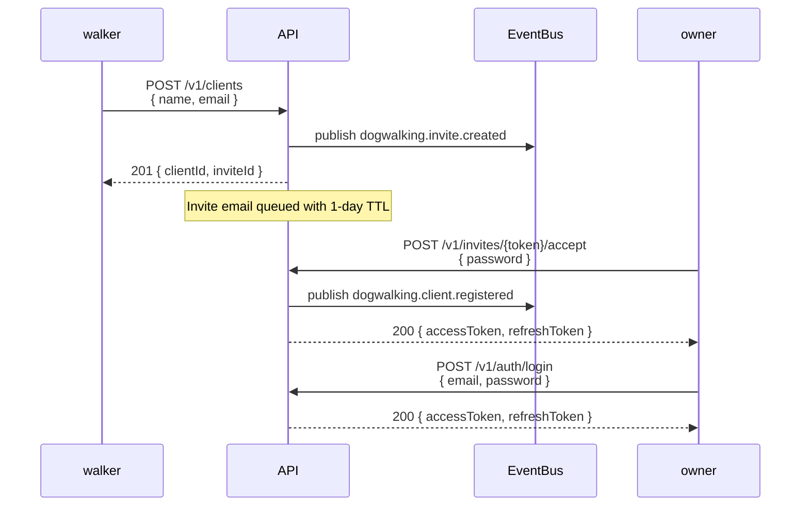

---

## Flow 3a: Authentication — Invite lifecycle (pending → accepted; expired path)

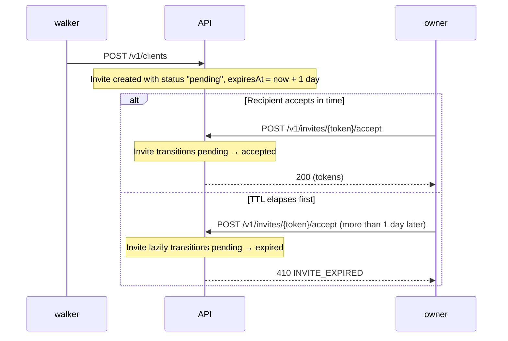

---

## Flow 3: Authentication — Password reset

Covers US-004.

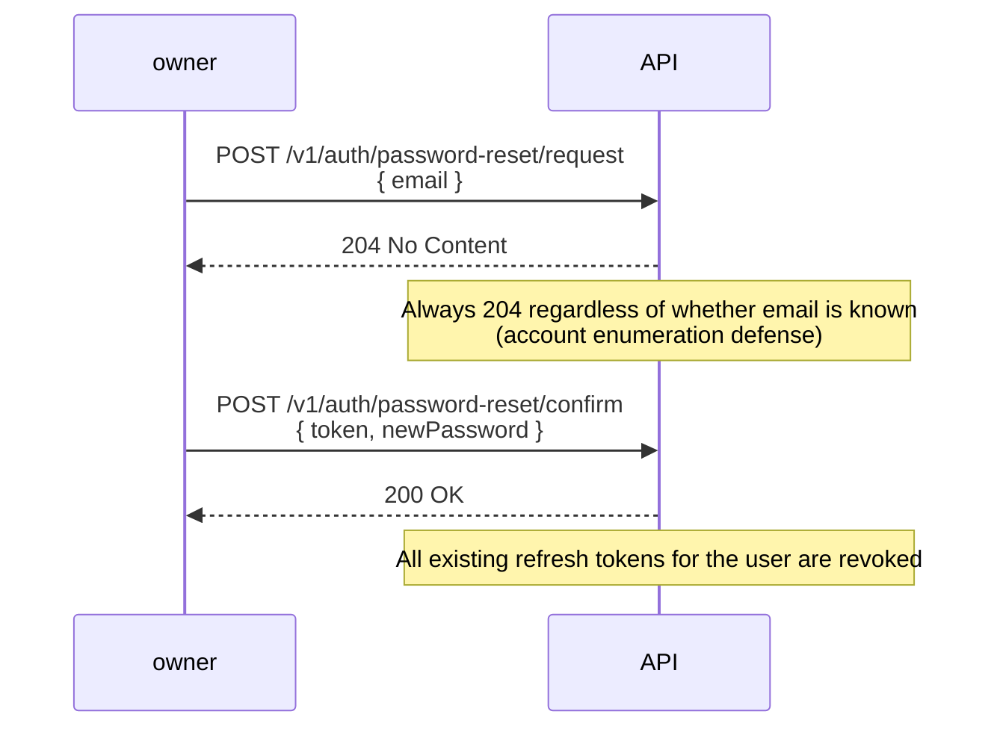

---

## Flow 3b: Authentication — Password-reset token lifecycle (pending → used; expired path)

```mermaid
sequenceDiagram
    participant owner
    participant API

    owner->>API: POST /v1/auth/password-reset/request
    Note over API: Reset token created with status "pending", expiresAt = now + 1 hour

    alt Confirm in time
        owner->>API: POST /v1/auth/password-reset/confirm {token, newPassword}
        Note over API: Token transitions pending → used; refresh tokens revoked
        API-->>owner: 200 OK
    else TTL elapses first
        owner->>API: POST /v1/auth/password-reset/confirm (more than 1 hour later)
        Note over API: Token lazily transitions pending → expired
        API-->>owner: 410 RESET_TOKEN_EXPIRED
    end
```

---

## Flow 4: Dogs — Owner adds and updates a dog

Covers US-005, US-006.

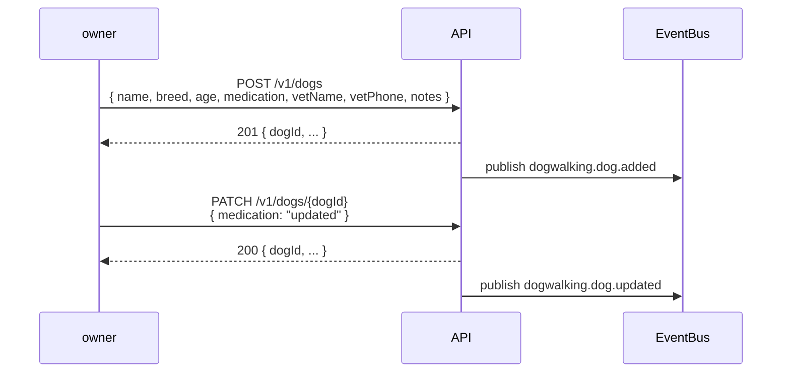

---

## Flow 5: Bookings — Owner-requested walk → walker decides

Covers US-007 (owner path), US-008, US-009, US-010.

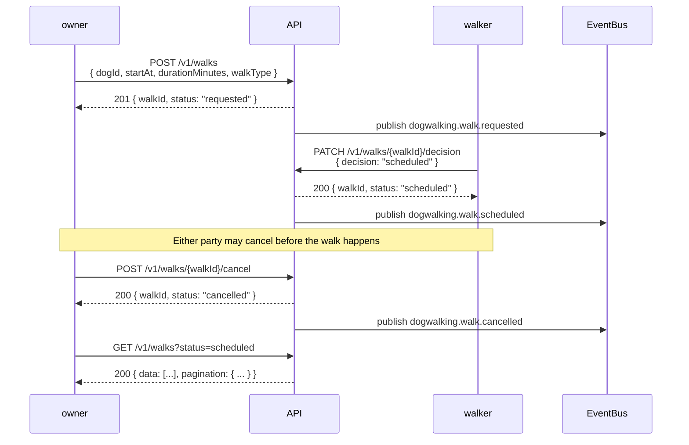

---

## Flow 6: Bookings — Walker declines a request

Covers the `requested → declined` path of US-008.

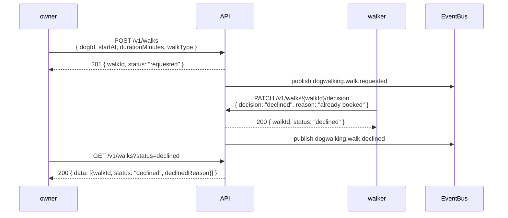

---

## Flow 7: Bookings — Walker creates walk directly (skip request stage)

Covers US-007 (walker path) — when Alison takes a booking via
WhatsApp and enters it in the app on the client's behalf.

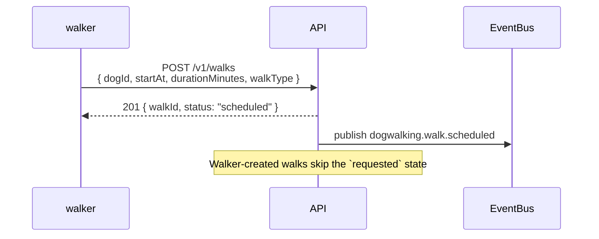

---

## Flow 8: Walks — Complete + post updates with photos

Covers US-011, US-012, US-013.

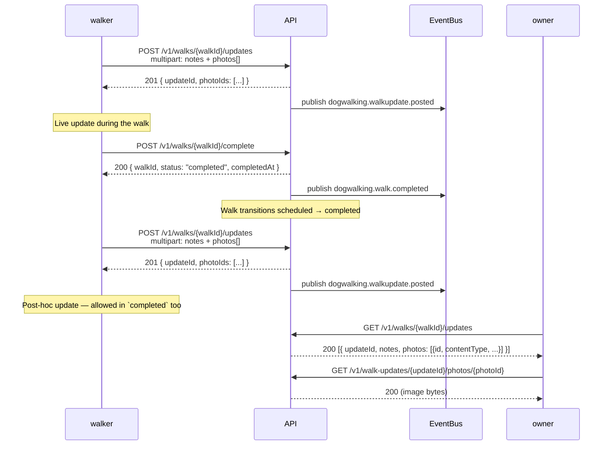

---

## Flow 9: Pricing — Walker sets rate card, owner views it

Covers US-017, US-018.

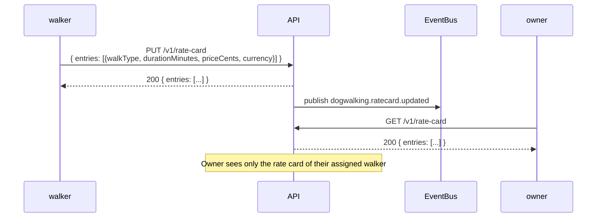

---

## Flow 10: Invoicing & Tipping — Generate, view, mark paid (with optional tip)

Covers US-014, US-015, US-016.

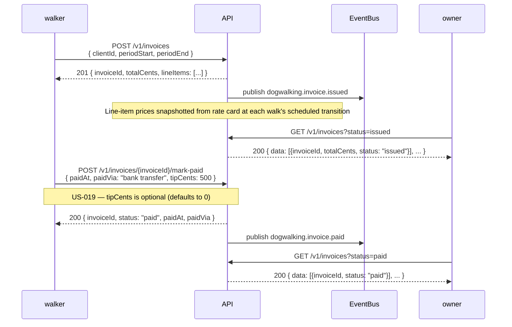
